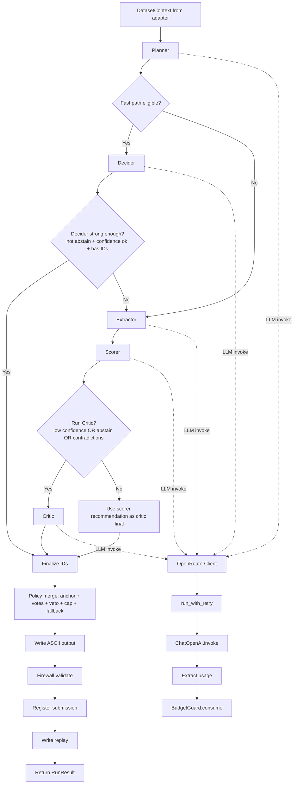

# Agent Activity Flow

This document focuses on how the multi-agent reasoning chain operates inside the orchestrator.

## 1) Agent steps in order

1. Planner analyzes dataset summary + feature lines and suggests route (fast or full).
2. Orchestrator evaluates fast-path conditions:
   - adaptive chain enabled 
   - candidate pool small enough
   - planner route is fast with enough confidence
3. If fast path is eligible:
   - Decider produces direct final IDs with confidence/abstain signal.
   - If decider is strong enough, pipeline can finish as fast path.
   - Otherwise pipeline falls back to full path.
4. Full path sequence:
   - Extractor selects likely IDs.
   - Scorer ranks and recommends IDs, emits confidence + contradiction signals.
   - Critic runs only when needed (low confidence, abstain, or contradictions).
5. Finalizer merges IDs from decider/critic/scorer/extractor with policy:
   - anchor source priority
   - vote threshold for non-anchor IDs
   - optional critic veto
   - cap by max_output_ids
   - fallback to top candidate subset if empty
6. Submission/output stage:
   - write ASCII output
   - firewall validation
   - register submission state
   - write replay log

## 2) Visual flow

## 3) Per-agent role summary

1. Planner: choose strategy and route recommendation.
2. Decider: quick direct decision for clear cases.
3. Extractor: maximize likely true positives from pool.
4. Scorer: rank evidence and output recommended IDs.
5. Critic: challenge weak picks and return cleaner final IDs.
