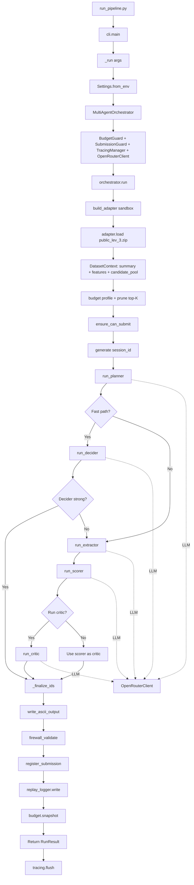

# Chi Tiết Luồng Chạy Pipeline Cho File public_lev_3.zip

## Lệnh Chạy Giả Định
```bash
python run_pipeline.py run --mode sandbox --dataset-path public_lev_3.zip --dataset-key public_lev_3 --output outputs/public_lev_3.txt
```

## Sơ Đồ Trực Quan



## 1. Điểm Khởi Đầu: run_pipeline.py
- **Hàm**: `main()` (từ `src/mirrorlife_agent/cli.py`)
- **Input**: Lệnh CLI với các tham số mode, dataset-path, dataset-key, output.
- **Xử lý**: 
  - Load env vars bằng `dotenv.load_dotenv()`.
  - Parse CLI args bằng `_build_parser()`.
  - Dispatch lệnh: `run` -> gọi `_run(args)`.

## 2. CLI _run(): Chuẩn Bị Và Khởi Tạo Orchestrator
- **File**: `src/mirrorlife_agent/cli.py`
- **Hàm**: `_run(args)`
- **Input**: args từ CLI (mode=sandbox, dataset_path=public_lev_3.zip, dataset_key=public_lev_3, output=outputs/public_lev_3.txt)
- **Xử lý**:
  - Load settings: `Settings.from_env()` (từ `config.py`).
  - Tạo `MultiAgentOrchestrator(settings)` (từ `orchestrator.py`).
  - Gọi `orchestrator.run(mode='sandbox', phase='evaluation', dataset_key='public_lev_3', dataset_path='public_lev_3.zip', output_path='outputs/public_lev_3.txt')`.

## 3. Orchestrator Khởi Tạo: Tạo Các Component An Toàn
- **File**: `src/mirrorlife_agent/orchestrator.py`
- **Hàm**: `MultiAgentOrchestrator.__init__`
- **Input**: settings (từ env vars).
- **Xử lý**:
  - Tạo `BudgetGuard` (theo max_usd, max_tokens).
  - Tạo `SubmissionGuard` (theo submission_state_file).
  - Tạo `TracingManager` (Langfuse nếu có keys).
  - Tạo `OpenRouterClient` (shared LLM client).
  - Tạo `ReplayLogger`.
- **Output**: Instance orchestrator sẵn sàng.

## 4. Orchestrator.run(): Bắt Đầu Pipeline Chính
- **File**: `src/mirrorlife_agent/orchestrator.py`
- **Hàm**: `run(...)`
- **Input**: mode, phase, dataset_key, dataset_path, output_path.
- **Xử lý Ban Đầu**:
  - Chuẩn hóa mode/phase.
  - Kiểm tra level mismatch (sandbox: key vs path phải match lev_3).
  - Build adapter: `build_adapter('sandbox', max_candidate_pool)` -> trả về `SandboxAdapter`.
  - Load dataset: `adapter.load('public_lev_3.zip', dataset_key='public_lev_3')` -> `DatasetContext` (summary_text, tool_features_text, candidate_pool).
  - Resolve budget profile: `auto` -> `low` (vì lev_3 <=3).
  - Prune candidate pool top-K (theo budget profile).
  - Ensure can submit: `submission_guard.ensure_can_submit('public_lev_3', 'evaluation')`.
  - Generate session_id (team-ULID).
  - Tính effective_max_output_ids (capped bởi settings, pool size, ratio).

## 5. Agent Chain: Planner -> Adaptive Path
- **File**: `src/mirrorlife_agent/orchestrator.py`
- **Hàm**: Trong `run(...)`
- **Input**: DatasetContext, session_id, etc.
- **Xử lý**:
  - Gọi `run_planner(client, session_id, context, model_override)` (từ `agents/planner.py`).
    - **Planner Input**: summary_text, tool_features_text, candidate_pool.
    - **Planner Output**: strategy, priority_signals, route_recommendation ('fast' hoặc 'full'), planner_confidence_0_to_1.
    - **LLM Call**: OpenRouterClient.invoke với system_prompt (Planner Agent), user_prompt (dataset info).
  - Đánh giá fast-path: nếu adaptive enabled, pool nhỏ, route='fast', confidence đủ -> dùng fast path.

## 6. Nhánh Fast Path: Decider
- **Điều kiện**: Fast path eligible và decider đủ mạnh.
- **Hàm**: `run_decider(client, session_id, context, planner_result, max_output_ids, model_override)` (từ `agents/decider.py`).
- **Input**: planner_result, DatasetContext, max_output_ids.
- **Xử lý**:
  - LLM call với system_prompt (Decider Agent), user_prompt (dataset + planner output).
- **Output**: final_ids, confidence_0_to_1, abstain, reason.
- **Kiểm tra**: Nếu confidence >= threshold, abstain=False, có IDs -> chốt fast path. Ngược lại -> fallback full path.

## 7. Nhánh Full Path: Extractor -> Scorer -> Critic
- **Điều kiện**: Không fast hoặc fallback từ fast.
- **Extractor**:
  - **Hàm**: `run_extractor(client, session_id, context, planner_result, max_output_ids, model_override)` (từ `agents/extractor.py`).
  - **Input**: planner_result, DatasetContext.
  - **Xử lý**: LLM call để select likely IDs.
  - **Output**: selected_ids, rationale.
- **Scorer**:
  - **Hàm**: `run_scorer(client, session_id, context, planner_result, extractor_result, max_output_ids, model_override)` (từ `agents/scorer.py`).
  - **Input**: planner_result, extractor_result, DatasetContext.
  - **Xử lý**: LLM call để rank và recommend IDs.
  - **Output**: ranked, recommended_ids, confidence_0_to_1, abstain, contradiction_signals.
- **Critic** (chạy có điều kiện):
  - **Điều kiện**: confidence thấp, abstain, hoặc có contradiction_signals.
  - **Hàm**: `run_critic(client, session_id, context, planner_result, extractor_result, scorer_result, max_output_ids, model_override)` (từ `agents/critic.py`).
  - **Input**: planner_result, extractor_result, scorer_result, DatasetContext.
  - **Xử lý**: LLM call để cross-check và clean IDs.
  - **Output**: final_ids, rejected_ids, critic_notes.
  - Nếu không chạy critic: dùng scorer recommended_ids làm critic final_ids.

## 8. Finalize IDs: Hợp Nhất Và Lọc
- **File**: `src/mirrorlife_agent/orchestrator.py`
- **Hàm**: `_finalize_ids(...)`
- **Input**: candidate_pool, decider/extractor/scorer/critic results, policy, max_output_ids, id_validator.
- **Xử lý**:
  - Sanitize IDs: lọc đúng format, trong pool, không trùng.
  - Tính votes: mỗi ID được đề xuất bởi agent nào.
  - Chọn anchor source (scorer/decider/critic/extractor theo priority và confidence).
  - Áp dụng veto (critic rejected), vote threshold, cap.
  - Fallback nếu rỗng: top subset của candidate_pool.
- **Output**: final_ids list.

## 9. Ghi Output Và Kiểm Tra An Toàn
- **File**: `src/mirrorlife_agent/orchestrator.py`
- **Hàm**: Trong `run(...)`
- **Xử lý**:
  - Gọi `submission_guard.write_ascii_output(final_ids, output_path, id_validator)` -> ghi file outputs/public_lev_3.txt (ASCII, 1 ID/line, no header).
  - Firewall validate: `submission_guard.firewall_validate(...)` (kiểm tra ratio, session, hash).
  - Register submission: `submission_guard.register_submission(...)` (ghi state).
  - Write replay: `replay_logger.write(...)` -> file JSON trong replays/.
  - Snapshot budget: `budget_guard.snapshot()`.
- **Output**: RunResult (mode, phase, dataset_key, session_id, output_path, final_ids, tokens, cost, replay_path).

## 10. Cleanup: Flush Tracing
- **File**: `src/mirrorlife_agent/orchestrator.py`
- **Hàm**: Trong `finally` block của `run(...)`
- **Xử lý**: `tracing.flush()` (gửi traces lên Langfuse nếu enabled).

## Tóm Tắt Agent Xử Lý
- **Planner**: Lập chiến lược, chọn route.
- **Decider**: Quyết định nhanh (nhánh fast).
- **Extractor**: Chọn IDs khả thi (nhánh full).
- **Scorer**: Rank và recommend (nhánh full).
- **Critic**: Kiểm tra và làm sạch (nhánh full, có điều kiện).

## Các File Được Tạo
- `outputs/public_lev_3.txt`: Output chính.
- `replays/[timestamp]_public_lev_3_[session].json`: Replay log.
- Submission state: Cập nhật file state cục bộ.

## Lưu Ý
- Tất cả agent gọi LLM qua `OpenRouterClient.invoke` với retry, tracing, budget consume.
- Pipeline adaptive: có thể skip critic để tiết kiệm token nếu confidence cao.
- An toàn: one-shot submit per dataset_key, firewall checks.</content>
<parameter name="file_path">/c:/Users/DucHieu/Documents/AI Agent Challenge/DETAILED_RUN_FLOW_PUBLIC_LEV_3.md