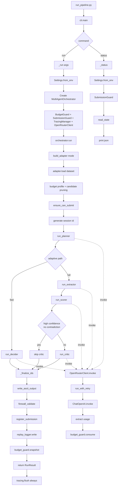

# Project Runtime Flow

This file summarizes how the project executes at runtime and where artifacts are written.

## 0. Visual Flow (Mermaid)



## 1. Entry Point

1. Run command starts at `run_pipeline.py`.
2. `run_pipeline.py` imports and calls `main()` from `src/mirrorlife_agent/cli.py`.

## 2. CLI Dispatch

Inside `src/mirrorlife_agent/cli.py`:

1. `main()` loads env vars with `load_dotenv()`.
2. `main()` parses CLI arguments.
3. Command dispatch:
   - `run` -> `_run(args)`
   - `status` -> `_status()`

## 3. Full `run` Flow

Inside `_run(args)`:

1. Load settings via `Settings.from_env()`.
2. Create `MultiAgentOrchestrator(settings)`.
3. Call `orchestrator.run(...)`.

Inside `MultiAgentOrchestrator.__init__`:

1. Create `BudgetGuard`.
2. Create `SubmissionGuard`.
3. Create `TracingManager`.
4. Create shared `OpenRouterClient`.

Inside `MultiAgentOrchestrator.run(...)`:

1. Build adapter with `build_adapter(mode, max_candidate_pool)`.
2. Load dataset context: `adapter.load(dataset_path, dataset_key)`.
3. Resolve budget profile and prune candidate pool top-K.
4. One-shot safety check: `submission_guard.ensure_can_submit(...)`.
5. Generate tracing session id.
6. Execute adaptive agent chain:
   - Fast path: `run_planner(...)` -> `run_decider(...)`
   - Full path: `run_planner(...)` -> `run_extractor(...)` -> `run_scorer(...)` -> `run_critic(...)`
7. Confidence gate can skip `critic` when confidence is high and no contradiction signals.
8. Merge/finalize ids with `_finalize_ids(...)`.
9. Write output txt via `submission_guard.write_ascii_output(...)`.
10. Run submission firewall checks: `submission_guard.firewall_validate(...)`.
11. Register local submission state: `submission_guard.register_submission(...)`.
12. Write replay log: `replay_logger.write(...)`.
13. Snapshot budget usage and return `RunResult`.
14. Always flush tracing in `finally`.

## 4. Agent -> LLM Call Path

All agents call the shared client:

- `planner`, `decider`, `extractor`, `scorer`, `critic` -> `OpenRouterClient.invoke(...)`

Inside `OpenRouterClient.invoke(...)`:

1. Wrap request with retry: `run_with_retry(...)`.
2. Build tracing callback.
3. Call model (`ChatOpenAI.invoke`) with session metadata.
4. Extract token usage -> `UsageRecord`.
5. Consume budget via `BudgetGuard.consume(...)`.
6. Normalize text response and return to agent.

## 5. `status` Flow

When command is `status`:

1. `run_pipeline.py` -> `cli.main()`.
2. `main()` dispatches to `_status()`.
3. `_status()`:
   - loads settings
   - creates `SubmissionGuard`
   - reads state with `guard.read_state()`
   - prints JSON state

## 6. Output Artifacts

Main artifacts written by the pipeline:

1. Final submission txt (ASCII, one ID per line, no header) at the `--output` path.
2. Replay json under `replays/` for offline debugging.
3. Submission state in the configured submission state file.

Typical existing outputs in this workspace are under:

- `outputs/`
- `outputs/answer/`
- `outputs/stability/`

## 7. Key Failure Points

1. Missing OpenRouter API key -> client init error.
2. Enforced Langfuse without keys -> tracing init error.
3. Adapter cannot infer schema or ids -> adapter load error.
4. Budget exceeded -> `BudgetExceededError`.
5. Invalid ids or duplicate eval submission -> `SubmissionGuardError`.
6. Malformed JSON-like model output -> parser fallback, possible quality drop.

## 8. Quick Run Commands

Example run:

```powershell
.\.venv\Scripts\python.exe run_pipeline.py run --mode sandbox --dataset-path public_lev_1.txt --dataset-key public_lev_1 --output outputs/public_lev_1.txt
```

Check status:

```powershell
.\.venv\Scripts\python.exe run_pipeline.py status
```